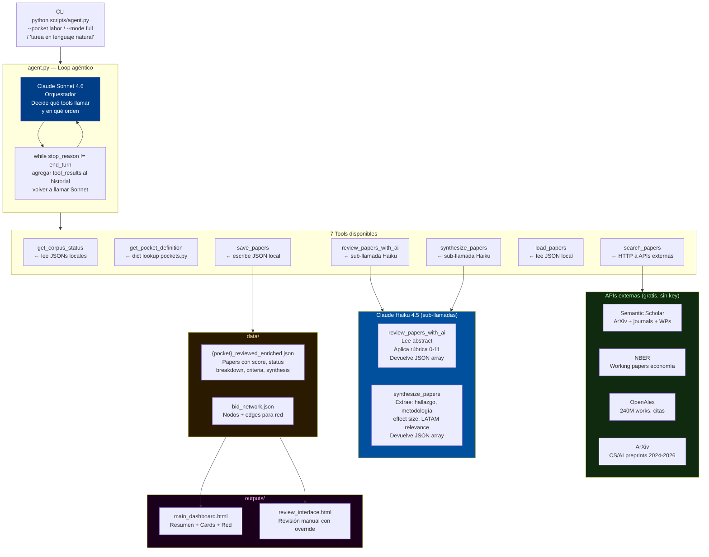

# Diagrama 1 — Pipeline General

Flujo completo desde entrada del usuario hasta outputs finales.

```mermaid
flowchart TD
    CLI["CLI\npython scripts/agent.py\n--pocket labor / --mode full\n/ 'tarea en lenguaje natural'"]

    subgraph AGENT["agent.py — Loop agéntico"]
        direction TB
        SONNET["Claude Sonnet 4.6\nOrquestador\nDecide qué tools llamar\ny en qué orden"]
        LOOP["while stop_reason != end_turn\nagregar tool_results al historial\nvolver a llamar Sonnet"]
        SONNET --> LOOP --> SONNET
    end

    subgraph TOOLS["7 Tools disponibles"]
        T1["get_corpus_status\n← lee JSONs locales"]
        T2["get_pocket_definition\n← dict lookup pockets.py"]
        T3["search_papers\n← HTTP a APIs externas"]
        T4["review_papers_with_ai\n← sub-llamada Haiku"]
        T5["synthesize_papers\n← sub-llamada Haiku"]
        T6["load_papers\n← lee JSON local"]
        T7["save_papers\n← escribe JSON local"]
    end

    subgraph EXTERNAL["APIs externas (gratis, sin key)"]
        SS["Semantic Scholar\nArXiv + journals + WPs"]
        NBER["NBER\nWorking papers economía"]
        OA["OpenAlex\n240M works, citas"]
        AX["ArXiv\nCS/AI preprints 2024-2026"]
    end

    subgraph HAIKU["Claude Haiku 4.5 (sub-llamadas)"]
        HR["review_papers_with_ai\nLee abstract\nAplica rúbrica 0-11\nDevuelve JSON array"]
        HS["synthesize_papers\nExtrae: hallazgo, metodología\neffect size, LATAM relevance\nDevuelve JSON array"]
    end

    subgraph DATA["data/"]
        D1["{pocket}_reviewed_enriched.json\nPapers con score, status\nbreakdown, criteria, synthesis"]
        D2["bid_network.json\nNodos + edges para red"]
    end

    subgraph OUTPUTS["outputs/"]
        O1["main_dashboard.html\nResumen + Cards + Red"]
        O2["review_interface.html\nRevisión manual con override"]
    end

    CLI --> AGENT
    AGENT --> TOOLS
    T3 --> EXTERNAL
    T4 --> HAIKU
    T5 --> HAIKU
    T7 --> DATA

    DATA --> O1
    DATA --> O2

    style SONNET fill:#003F88,color:#fff
    style HAIKU fill:#00509D,color:#fff
    style EXTERNAL fill:#0f2a0f,color:#aaffaa
    style DATA fill:#2a1a00,color:#ffddaa
    style OUTPUTS fill:#1a001a,color:#ffaaff
```