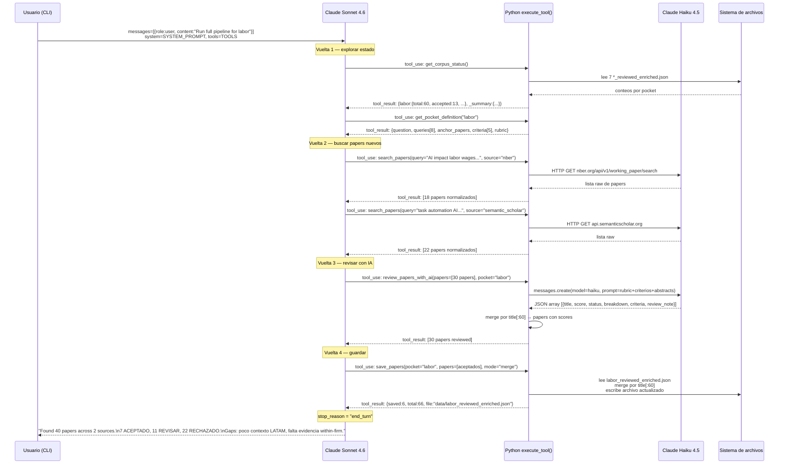

# Diagrama 2 — Loop interno del agente

Cómo crece el historial de mensajes en cada vuelta del loop.

```mermaid
sequenceDiagram
    participant U as Usuario (CLI)
    participant S as Claude Sonnet 4.6
    participant P as Python execute_tool()
    participant H as Claude Haiku 4.5
    participant FS as Sistema de archivos

    U->>S: messages=[{role:user, content:"Run full pipeline for labor"}]<br/>system=SYSTEM_PROMPT, tools=TOOLS

    Note over S: Vuelta 1 — explorar estado

    S->>P: tool_use: get_corpus_status()
    P->>FS: lee 7 *_reviewed_enriched.json
    FS-->>P: conteos por pocket
    P-->>S: tool_result: {labor:{total:60, accepted:13, ...}, _summary:{...}}

    S->>P: tool_use: get_pocket_definition("labor")
    P-->>S: tool_result: {question, queries[8], anchor_papers, criteria[5], rubric}

    Note over S: Vuelta 2 — buscar papers nuevos

    S->>P: tool_use: search_papers(query="AI impact labor wages...", source="nber")
    P->>H: HTTP GET nber.org/api/v1/working_paper/search
    H-->>P: lista raw de papers
    P-->>S: tool_result: [18 papers normalizados]

    S->>P: tool_use: search_papers(query="task automation AI...", source="semantic_scholar")
    P->>H: HTTP GET api.semanticscholar.org
    H-->>P: lista raw
    P-->>S: tool_result: [22 papers normalizados]

    Note over S: Vuelta 3 — revisar con IA

    S->>P: tool_use: review_papers_with_ai(papers=[30 papers], pocket="labor")
    P->>H: messages.create(model=haiku, prompt=rubric+criterios+abstracts)
    H-->>P: JSON array [{title, score, status, breakdown, criteria, review_note}]
    P->>P: merge por title[:60] → papers con scores
    P-->>S: tool_result: [30 papers reviewed]

    Note over S: Vuelta 4 — guardar

    S->>P: tool_use: save_papers(pocket="labor", papers=[aceptados], mode="merge")
    P->>FS: lee labor_reviewed_enriched.json<br/>merge por title[:60]<br/>escribe archivo actualizado
    P-->>S: tool_result: {saved:6, total:66, file:"data/labor_reviewed_enriched.json"}

    Note over S: stop_reason = "end_turn"

    S-->>U: "Found 40 papers across 2 sources.\n7 ACEPTADO, 11 REVISAR, 22 RECHAZADO.\nGaps: poco contexto LATAM, falta evidencia within-firm."
```