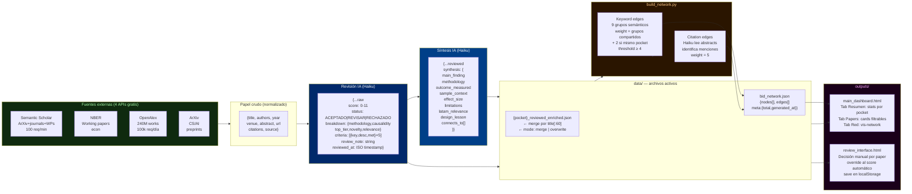

# Diagrama 3 — Flujo de datos

De donde vienen los datos, cómo se transforman, y dónde terminan.

```mermaid
flowchart LR
    subgraph SOURCES["Fuentes externas (4 APIs gratis)"]
        SS["Semantic Scholar\nArXiv+journals+WPs\n100 req/min"]
        NB["NBER\nWorking papers\necon"]
        OA["OpenAlex\n240M works\n100k req/día"]
        AX["ArXiv\nCS/AI\npreprints"]
    end

    subgraph RAW["Papel crudo (normalizado)"]
        R["{title, authors, year\nvenue, abstract, url\ncitations, source}"]
    end

    subgraph REVIEW["Revisión IA (Haiku)"]
        RV["{...raw\nscore: 0-11\nstatus: ACEPTADO|REVISAR|RECHAZADO\nbreakdown: {methodology,causalidity\ntop_tier,novelty,relevance}\ncriteria: [{key,desc,met}×5]\nreview_note: string\nreviewed_at: ISO timestamp}"]
    end

    subgraph SYNTH["Síntesis IA (Haiku)"]
        SY["{...reviewed\nsynthesis: {\n  main_finding\n  methodology\n  outcome_measured\n  sample_context\n  effect_size\n  limitations\n  latam_relevance\n  design_lesson\n  connects_to[]\n}}"]
    end

    subgraph PERSIST["data/ — archivos activos"]
        PE["{pocket}_reviewed_enriched.json\n← merge por title[:60]\n← mode: merge | overwrite"]
        BN["bid_network.json\n{nodes[], edges[]\nmeta:{total,generated_at}}"]
    end

    subgraph NET["build_network.py"]
        KW["Keyword edges\n9 grupos semánticos\nweight = grupos compartidos\n+ 2 si mismo pocket\nthreshold ≥ 4"]
        CI["Citation edges\nHaiku lee abstracts\nidentifica menciones\nweight = 5"]
    end

    subgraph UI["outputs/"]
        MD["main_dashboard.html\nTab Resumen: stats por pocket\nTab Papers: cards filtrables\nTab Red: vis-network"]
        RI["review_interface.html\nDecisión manual por paper\noverride al score automático\nsave en localStorage"]
    end

    SOURCES --> RAW
    RAW --> REVIEW
    REVIEW --> SYNTH
    SYNTH --> PERSIST
    REVIEW --> PERSIST

    PERSIST --> NET
    NET --> KW
    NET --> CI
    KW --> BN
    CI --> BN

    PERSIST --> MD
    PERSIST --> RI
    BN --> MD

    style SOURCES fill:#0f2a0f,color:#aaffaa
    style REVIEW fill:#00296B,color:#fff
    style SYNTH fill:#003F88,color:#fff
    style NET fill:#2a1500,color:#ffcc88
    style UI fill:#1a001a,color:#ffaaff
```