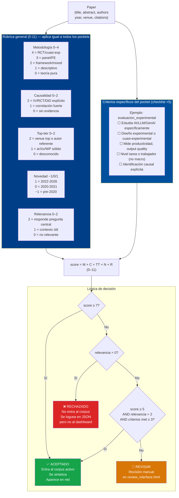

# Diagrama 4 — Sistema de scoring y decisión

Cómo se califica un paper y cómo se decide su status.

```mermaid
flowchart TD
    P["Paper\n{title, abstract, authors\nyear, venue, citations}"]

    subgraph RUBRIC["Rúbrica general (0-11) — aplica igual a todos los pockets"]
        M["Metodología 0–4\n4 = RCT/cuasi-exp\n3 = panel/FE\n2 = framework/mixed\n1 = descriptivo\n0 = teoría pura"]
        C["Causalidad 0–2\n2 = IV/RCT/DiD explícito\n1 = correlación fuerte\n0 = sin evidencia"]
        TT["Top-tier 0–2\n2 = venue top o autor referente\n1 = arXiv/WP sólido\n0 = desconocido"]
        N["Novedad −1/0/1\n1 = 2022-2026\n0 = 2020-2021\n−1 = pre-2020"]
        R["Relevancia 0–2\n2 = responde pregunta central\n1 = contexto útil\n0 = no relevante"]
    end

    subgraph CRITERIA["Criterios específicos del pocket (checklist ×5)"]
        CR["Ejemplo: evaluacion_experimental\n☐ Estudia IA/LLM/GenAI específicamente\n☐ Diseño experimental o cuasi-experimental\n☐ Mide productividad, output quality\n☐ Nivel tarea o trabajador (no macro)\n☐ Identificación causal explícita"]
    end

    SCORE["score = M + C + TT + N + R\n(0–11)"]

    subgraph DECISION["Lógica de decisión"]
        D1{"score ≥ 7?"}
        D2{"score ≥ 5\nAND relevancia = 2\nAND criterios met ≥ 3?"}
        D3{"relevancia = 0?"}
        ACC["✅ ACEPTADO\nEntra al corpus activo\nSe sintetiza\nAparece en red"]
        REV["🔄 REVISAR\nRevisión manual\nen review_interface.html"]
        REJ["❌ RECHAZADO\nNo entra al corpus\nSe loguea en JSON\npero no al dashboard"]
    end

    P --> RUBRIC
    P --> CRITERIA
    RUBRIC --> SCORE
    CRITERIA --> SCORE
    SCORE --> D1
    D1 -->|Sí| ACC
    D1 -->|No| D3
    D3 -->|Sí| REJ
    D3 -->|No| D2
    D2 -->|Sí| ACC
    D2 -->|No| REV

    style ACC fill:#16a34a,color:#fff
    style REV fill:#d97706,color:#fff
    style REJ fill:#dc2626,color:#fff
    style RUBRIC fill:#003F88,color:#fff
    style CRITERIA fill:#00509D,color:#fff
```