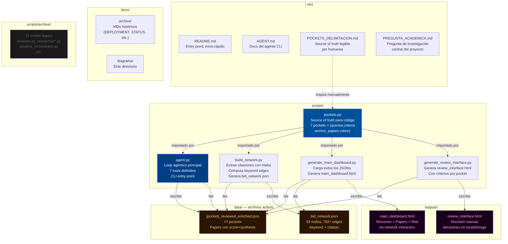

# Diagrama 5 — Estructura de archivos y dependencias

Qué archivo hace qué y cómo se relacionan entre sí.

```mermaid
graph TD
    subgraph ROOT["/ raíz"]
        README["README.md\nEntry point, inicio rápido"]
        AGENT_MD["AGENT.md\nDocs del agente CLI"]
        POCKETS_MD["POCKETS_DELIMITACION.md\nSource of truth legible\npor humanos"]
        PREGUNTA["PREGUNTA_ACADEMICA.md\nPregunta de investigación\ncentral del proyecto"]
    end

    subgraph SCRIPTS["scripts/"]
        AGENT["agent.py\nLoop agéntico principal\n7 tools definidos\nCLI entry point"]
        POCKETS_PY["pockets.py\nSource of truth para código\n7 pockets × {queries,criteria\nanchor_papers,rubric}"]
        BN["build_network.py\nExtrae citaciones con Haiku\nComputa keyword edges\nGenera bid_network.json"]
        GMD["generate_main_dashboard.py\nCarga todos los JSONs\nGenera main_dashboard.html"]
        GRI["generate_review_interface.py\nGenera review_interface.html\nCon criterios por pocket"]
    end

    subgraph DATA["data/ — archivos activos"]
        RE["{pocket}_reviewed_enriched.json\n×7 pockets\nPapers con score+synthesis"]
        BNET["bid_network.json\n93 nodos, 782+ edges\nkeyword + citation"]
    end

    subgraph OUTPUTS["outputs/"]
        MAIN["main_dashboard.html\nResumen + Papers + Red\nvis-network interactivo"]
        REVIEW["review_interface.html\nRevisión manual\ndecisiones en localStorage"]
    end

    subgraph DOCS["docs/"]
        ARCHIVE_D["archive/\nMDs históricos\n(DEPLOYMENT, STATUS, etc.)"]
        DIAGS["diagrams/\nEste directorio"]
    end

    subgraph ARCHIVE["scripts/archive/"]
        OLD["31 scripts legacy\nreviewer.py, researcher*.py\npipeline_orchestrator.py\netc."]
    end

    POCKETS_PY -->|importado por| AGENT
    POCKETS_PY -->|importado por| BN
    POCKETS_PY -->|importado por| GMD
    POCKETS_PY -->|importado por| GRI

    AGENT -->|escribe| RE
    AGENT -->|lee| RE

    BN -->|lee| RE
    BN -->|escribe| BNET

    GMD -->|lee| RE
    GMD -->|lee| BNET
    GMD -->|escribe| MAIN

    GRI -->|lee| RE
    GRI -->|escribe| REVIEW

    POCKETS_MD -.->|inspira manualmente| POCKETS_PY

    style AGENT fill:#003F88,color:#fff
    style POCKETS_PY fill:#00509D,color:#fff
    style RE fill:#2a1500,color:#ffcc88
    style BNET fill:#2a1500,color:#ffcc88
    style MAIN fill:#1a001a,color:#ffaaff
    style REVIEW fill:#1a001a,color:#ffaaff
    style OLD fill:#1a1a1a,color:#666
```