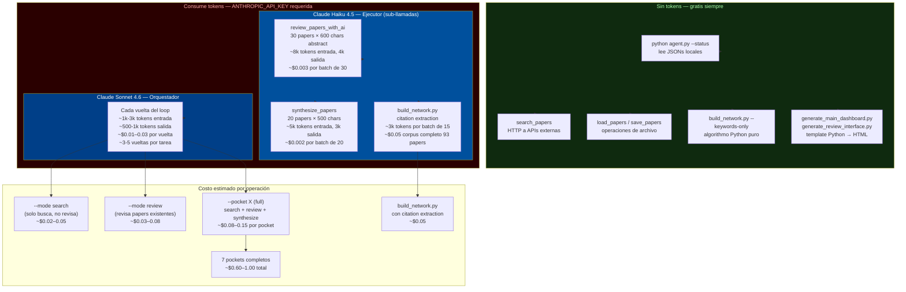

# Diagrama 6 — Mapa de tokens: qué cuesta qué

Cuándo se consumen tokens de Anthropic y cuándo no.

```mermaid
flowchart TD
    subgraph FREE["Sin tokens — gratis siempre"]
        S1["python agent.py --status\nlee JSONs locales"]
        S2["search_papers\nHTTP a APIs externas"]
        S3["load_papers / save_papers\noperaciones de archivo"]
        S4["build_network.py --keywords-only\nalgorithmo Python puro"]
        S5["generate_main_dashboard.py\ngenerate_review_interface.py\ntemplate Python → HTML"]
    end

    subgraph PAID["Consume tokens — ANTHROPIC_API_KEY requerida"]
        subgraph SONNET["Claude Sonnet 4.6 — Orquestador"]
            P1["Cada vuelta del loop\n~1k-3k tokens entrada\n~500-1k tokens salida\n~$0.01–0.03 por vuelta\n~3-5 vueltas por tarea"]
        end
        subgraph HAIKU["Claude Haiku 4.5 — Ejecutor (sub-llamadas)"]
            P2["review_papers_with_ai\n30 papers × 600 chars abstract\n~8k tokens entrada, 4k salida\n~$0.003 por batch de 30"]
            P3["synthesize_papers\n20 papers × 500 chars\n~5k tokens entrada, 3k salida\n~$0.002 por batch de 20"]
            P4["build_network.py\ncitation extraction\n~3k tokens por batch de 15\n~$0.05 corpus completo 93 papers"]
        end
    end

    subgraph COST["Costo estimado por operación"]
        C1["--mode search\n(solo busca, no revisa)\n~$0.02–0.05"]
        C2["--mode review\n(revisa papers existentes)\n~$0.03–0.08"]
        C3["--pocket X (full)\nsearch + review + synthesize\n~$0.08–0.15 por pocket"]
        C4["7 pockets completos\n~$0.60–1.00 total"]
        C5["build_network.py\ncon citation extraction\n~$0.05"]
    end

    FREE --> S1 & S2 & S3 & S4 & S5
    PAID --> P1 & P2 & P3 & P4
    P1 --> C1 & C2 & C3
    C3 --> C4
    P4 --> C5

    style FREE fill:#0f2a0f,color:#aaffaa
    style PAID fill:#2a0000,color:#ffaaaa
    style SONNET fill:#003F88,color:#fff
    style HAIKU fill:#00509D,color:#fff
```